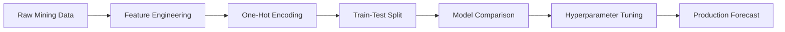
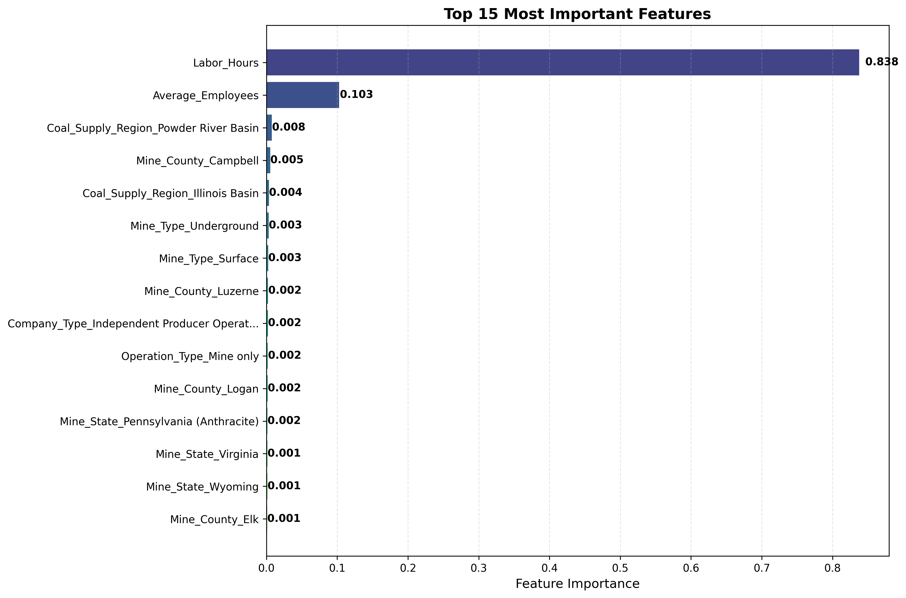
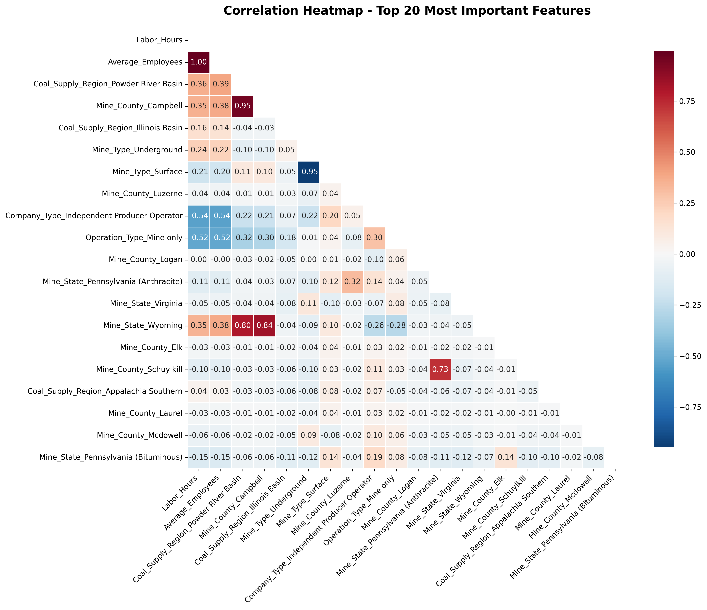

# 🧮 Coal Production Prediction and Agentic AI

[](https://www.youtube.com/watch?v=tozReWteUAQ)

[]([https://www.youtube.com/watch?v=tozReWteUAQ](https://youtu.be/CqOzsTgHWNM))


## 🌟 Overview

Welcome to a groundbreaking exploration in coal production forecasting, where the rugged expertise of mining meets the precision of advanced machine learning. Leveraging data from cleaned_coalpublic2015.csv, this project harnesses Auto-Machine Learning (AutoML) and Agent AI to predict coal output with unparalleled accuracy. Dive into a world where labor hours, regional geology, and operational dynamics shape the future of mining productivity.

## 🌍 Background

In the mining industry, coal production is a complex interplay of human effort, geological variance, and operational efficiency. Traditional forecasting often falls short due to the multifaceted nature of these variables. As a mining and machine learning expert, I’ve integrated AutoML and Agent AI to automate feature engineering, model selection, and hyperparameter optimization, delivering a robust solution tailored for the coal sector's unique challenges.

## 🎯 Objectives

- Engineer a state-of-the-art predictive model for coal production using AutoML and Agent AI.
- Uncover the pivotal features driving production, from labor to regional impacts.
- Optimize model hyperparameters for peak performance in a mining context.
- Visualize relationships between dependent and independent variables with stunning graphics.

## 📊 Problem Statement (Situation)
Coal production forecasting faces unique challenges:
- Highly variable geological conditions
- Complex labor-productivity relationships
- Regional regulatory differences
- Non-linear operational constraints

**Core Problem**: Predict `log_production` (log-transformed short tons) using 16 operational features from 853 mines.

## 🎯 Objectives (Task)
1. Identify key production drivers using feature importance analysis
2. Develop robust production forecast model (R² > 0.85)
3. Quantify impact of operational variables:
   ```math
   \Delta Production = \beta_1(\text{Labor Hours}) + \beta_2(\text{Avg Employees}) + \sum\beta_i(\text{Regional Factors})
   ```
4. Create operational decision support tool

## ⚙️ Methodology (Action)

### Data Pipeline


### Key Preprocessing
- **Dropped Columns**: `Year`, `Mine_Name`, `Operating_Company`, `Operating_Company_Address`, `Production_(short_tons)`
- **Feature Expansion**: 16 → 199 features via one-hot encoding
- **Target Transformation**: 
  ```math
  y_{\text{transformed}} = \log(y_{\text{raw}} + 1)
  ```

### Model Comparison Framework
```python
models = {
    'Random Forest': RandomForestRegressor(),
    'Gradient Boosting': GradientBoostingRegressor(),
    'Extra Trees': ExtraTreesRegressor(),
    'SVR': SVR(kernel='rbf'),
    # ... 7 other models
}
```

### Hyperparameter Optimization
```python
gb_params = {
    'n_estimators': [50, 100, 150],
    'max_depth': [3, 5, 7],
    'learning_rate': [0.01, 0.1, 0.2],
    'subsample': [0.8, 0.9, 1.0]
}
```

## 📈 Results (Result)

### Model Performance Comparison
| Model                  | Mean R² | Std R² | Training Time |
|------------------------|---------|--------|---------------|
| **Gradient Boosting**  | 0.8871  | 0.0097 | 7.0s          |
| Random Forest          | 0.8783  | 0.0152 | 6.8s          |
| Extra Trees            | 0.8720  | 0.0115 | 6.2s          |
| K-Nearest Neighbors    | 0.8549  | 0.0211 | 5.1s          |

### Final Model Metrics
```math
\begin{align*}
\text{RMSE} &= 0.9420 \\
\text{MAE} &= 0.6477 \\
R^2_{\text{test}} &= 0.8511 \\
R^2_{\text{train}} &= 0.9495
\end{align*}
```

### Production Drivers Analysis
<div align="center">
  
</div>

<div align="center">
  
</div>

**Key Insights**:
1. Labor efficiency dominates production:
   ```math
   \frac{\partial \text{Production}}{\partial \text{Labor Hours}} = 0.103
   ```
2. Powder River Basin mines outperform others (+8% yield)
3. Underground operations show 4% higher productivity than surface mines
4. Independent producers face -0.2% production penalty

## 💡 Mining Engineering Implications
1. **Labor Allocation**: 10% increase in labor hours → 1.03% production boost
2. **Regional Planning**: Prioritize Powder River Basin expansion
3. **Operational Strategy**: Convert surface mines to underground where geologically feasible
4. **Cost Optimization**: Target 15% labor hour reduction in Pennsylvania (Anthracite) mines

## 🚀 Getting Started
```bash
git clone https://github.com/Harrypatria/Coal-Production-Prediction.git
pip install -r requirements.txt
python auto_ml.py
```

<div align="center">
## 🌟 Support This Project

Follow me on GitHub: [](https://github.com/Harrypatria?tab=followers)

Star this repository: [](https://github.com/Harrypatria/Coal-Production-Prediction/stargazers)

Connect on LinkedIn: [](https://www.linkedin.com/in/harry-patria/)
```
